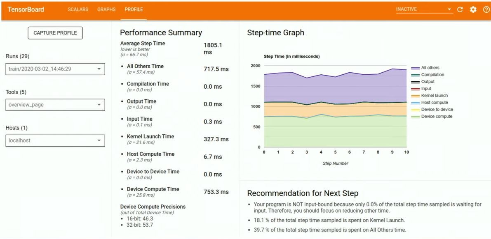
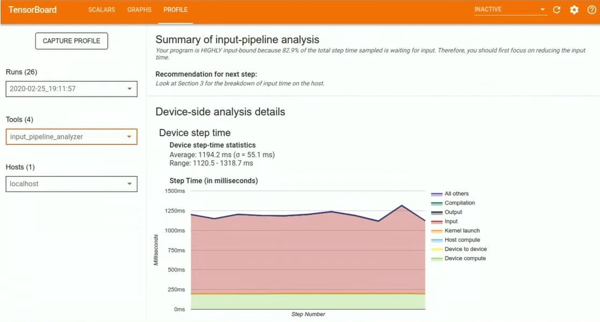
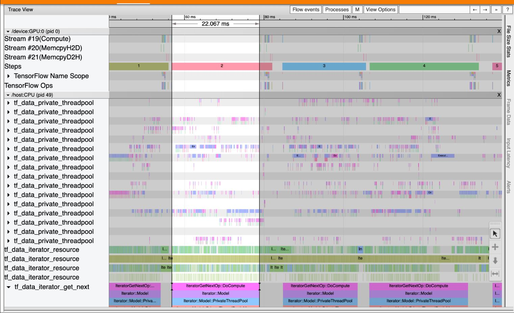

# TF-Dev-Summit-2020
My Notes on Tensorflow Dev Summit 2020

# Table of Contents

- [Scaling Tensorflow data processing with tf.data](#scaling-tf-data)
- [TensorFlow 2 Performance Profiler](#profiler)

# Notes
<a id="scaling-tf-data"></a>

## Scaling Tensorflow data processing with tf.data

Link: [https://youtu.be/n7byMbl2VUQ](https://youtu.be/n7byMbl2VUQ )

### TLDR:

- Check official **tf.data** guide and performance guide.
- Reuse computation with **tf.data snapshot**
- Distribute computation with **tf.data service**

### Notes: 

Official **tf.data** guide: [https://www.tensorflow.org/guide/data](https://www.tensorflow.org/guide/data)

Normal pipeline:

```python
import tensorflow as tf

def expensive_preprocess(record):
	...
	
dataset = tf.data.TFRecordDataset(".../*.tfrecord")
dataset = dataset.map(expensive_preprocess)

dataset = dataset.shuffle(buffer_size=1024)
dataset = dataset.batch(batch_size=32)

dataset = dataset.prefetch()

model = tf.keras.Model(...)
model.fit(dataset)
```

Improve single host performance guide: [https://www.tensorflow.org/guide/data_performance](https://www.tensorflow.org/guide/data_performance)

- Prefetch
- Parallel interleave
- Parallel map

Still bottleneck? 

**Idea 1: reuse computation with tf.data snapshot**

- Save the data transformation to hard disks and read later.

- Good for experimenting with model architectures, hyperparameter tuning.
- Should use before any transformation which requires randomness, such as cropping, shuffle.
- **Available in 2.3**

```python
def expensive_preprocess(record):
	...
	
dataset = tf.data.TFRecordDataset(".../*.tfrecord")
dataset = dataset.map(expensive_preprocess)

# snapshot all above
dataset = dataset.snapshot("/path/to/snapshot_dir")

dataset = dataset.shuffle(buffer_size=1024)
dataset = dataset.batch(batch_size=32)

dataset = dataset.prefetch()
```


**Idea 2: distribute computation with tf.data service**

- Offload the computation to a cluster of workers
- Use **tf.data service** to scale horizontally: fault tolerant, exactly once guarantee
- **Available in 2.3**

```python
def randomized_preprocess(record):
	...
	
dataset = tf.data.TFRecordDataset(".../*.tfrecord")
dataset = dataset.map(randomized_preprocess) # need randomess so can not snapshot
dataset = dataset.shuffle(buffer_size=1024)
dataset = dataset.batch(batch_size=32)

# offload all above computations to a cluster of workers
dataset = dataset.distribute("<master_address>")

# below code will run on the host
dataset = dataset.prefetch()
```

<a id="profiler"></a>

## TensorFlow 2 Performance Profiler


Link: [https://youtu.be/pXHAQIhhMhI](https://youtu.be/pXHAQIhhMhI)

### TLDR:

- Use Profiler plugin in Tensorboard to aggregate & analyze the performance.
- Used extensively inside Google to tune products
- Tool Set: Overview, Input Pipeline Analyzer, TensorFlow Stats, Trace Viewer
- Each tool has recommendations for next step: link to other tools or tutorials

### Notes:

Tensorflow 2 Profiler Tool Set:

- Overview Page
- Input Pipeline Analyzer
- TensorFlow Stats
- Trace Viewer

Each tool has recommendations for next step: link to other tools or tutorials

Code:

```python
import tensorflow as tf

# Create your model & data preprocessing

# Create a TensorBoard callback
tb_callback = tf.keras.callbacks.TensorBoard(log_dir="...",
                                            profile_batch='150, 160')
# 150, 160 means: do profile on from batch 150 to 160

model.fit(...., callbacks=[tb_callback])
```

Overview Page



Input Pipeline Analyzer



TensorFlow Stats


Trace Viewer

