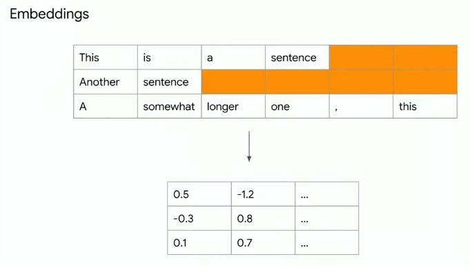
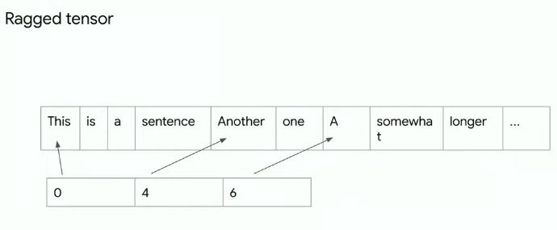

# TF-Dev-Summit-2020
My Notes on Tensorflow Dev Summit 2020

# Table of Contents

- [Scaling Tensorflow data processing with tf.data](#scaling-tf-data)
- [TensorFlow 2 Performance Profiler](#profiler)
- [Research with TensorFlow](#research)
- [TensorFlow Hub: Making model discovery easy](#tf-hub)
- [Collaborative ML with TensorBoard.dev](#tensorboard-dev)
- [TF 2.x on Kaggle](#kaggle)

# Notes
<a id="scaling-tf-data"></a>

## Scaling Tensorflow data processing with tf.data

Link: [https://youtu.be/n7byMbl2VUQ](https://youtu.be/n7byMbl2VUQ )

### TLDR:

- Check official **tf.data** guide and performance guide.
- Reuse computation with **tf.data snapshot**
- Distribute computation with **tf.data service**

### Notes: 

Official **tf.data** guide: [https://www.tensorflow.org/guide/data](https://www.tensorflow.org/guide/data)

Normal pipeline:

```python
import tensorflow as tf

def expensive_preprocess(record):
	...
	
dataset = tf.data.TFRecordDataset(".../*.tfrecord")
dataset = dataset.map(expensive_preprocess)

dataset = dataset.shuffle(buffer_size=1024)
dataset = dataset.batch(batch_size=32)

dataset = dataset.prefetch()

model = tf.keras.Model(...)
model.fit(dataset)
```

Improve single host performance guide: [https://www.tensorflow.org/guide/data_performance](https://www.tensorflow.org/guide/data_performance)

- Prefetch
- Parallel interleave
- Parallel map

Still bottleneck? 

**Idea 1: reuse computation with tf.data snapshot**

- Save the data transformation to hard disks and read later.

- Good for experimenting with model architectures, hyperparameter tuning.
- Should use before any transformation which requires randomness, such as cropping, shuffle.
- **Available in 2.3**

```python
def expensive_preprocess(record):
	...
	
dataset = tf.data.TFRecordDataset(".../*.tfrecord")
dataset = dataset.map(expensive_preprocess)

# snapshot all above
dataset = dataset.snapshot("/path/to/snapshot_dir")

dataset = dataset.shuffle(buffer_size=1024)
dataset = dataset.batch(batch_size=32)

dataset = dataset.prefetch()
```


**Idea 2: distribute computation with tf.data service**

- Offload the computation to a cluster of workers
- Use **tf.data service** to scale horizontally: fault tolerant, exactly once guarantee
- **Available in 2.3**

```python
def randomized_preprocess(record):
	...
	
dataset = tf.data.TFRecordDataset(".../*.tfrecord")
dataset = dataset.map(randomized_preprocess) # need randomess so can not snapshot
dataset = dataset.shuffle(buffer_size=1024)
dataset = dataset.batch(batch_size=32)

# offload all above computations to a cluster of workers
dataset = dataset.distribute("<master_address>")

# below code will run on the host
dataset = dataset.prefetch()
```

<a id="profiler"></a>

## TensorFlow 2 Performance Profiler


Link: [https://youtu.be/pXHAQIhhMhI](https://youtu.be/pXHAQIhhMhI)

### TLDR:

- Use Profiler plugin in Tensorboard to aggregate & analyze the performance.
- Used extensively inside Google to tune products
- Tool Set: Overview, Input Pipeline Analyzer, TensorFlow Stats, Trace Viewer
- Each tool has recommendations for next step: link to other tools or tutorials

### Notes:

Tensorflow 2 Profiler Tool Set:

- Overview Page
- Input Pipeline Analyzer
- TensorFlow Stats
- Trace Viewer

Each tool has recommendations for next step: link to other tools or tutorials

Code:

```python
import tensorflow as tf

# Create your model & data preprocessing

# Create a TensorBoard callback
tb_callback = tf.keras.callbacks.TensorBoard(log_dir="...",
                                            profile_batch='150, 160')
# 150, 160 means: do profile from batch 150 to 160

model.fit(...., callbacks=[tb_callback])
```

Overview Page


Input Pipeline Analyzer


TensorFlow Stats


Trace Viewer


<a id="research"></a>

## Research with TensorFlow

Link: [https://youtu.be/51YtxSH-U3Y](https://youtu.be/51YtxSH-U3Y)

### TLDR:

- TensorFlow is **controllable, flexible, composable** -> useful for research.
- Use **tf.variable_creator_scope** to control the state of variables, layers, even with the existing kernels such as Keras layers.
- Use **tf.function(..., experimental_compile=True)** for automatic compilation
- Use **vectorization** for short, fast code
- Ragged data to work with non-tensor data types.

### Notes:

**Controlling State:**

- Can control the state of kernel inside TensorFlow library
- Tool: **tf.variable_creator_scope**
- Allow to do dependency injection to the available Tensorflow code & change behaviors instead of rewriting the function.

````python
# Custom variables
class FactorizedVariable(tf.Module):
    def __init__(self, a, b):
        self.a = a
        self.b = b
# how do I use above type as a step of computation: tf.matmul in this case
tf.register_tensor_conversion_function(FactorizedVariable, lambda x, *a, **k: tf.matmul(x.a, x.b))

# create the object inside the scope
def scope(next_creator, **kwargs):
    shape = kwargs["initial_value"]().shape
    # check if we want to create the variable or delegate for other as normal
    if len(shape) != 2: return next_creator(**kwargs)
    # use the custom variable
    return FactorizedVariable(tf.Variable(tf.random.normal([shape[0], 2])),
                              tf.Variable(tf.random.normal([2, shape[1]])))

# modify the Keras Dense Layer
with tf.variable_creator_scope(scope):
    d = tf.keras.layers.Dense(10)
    d(tf.zeros([20, 10]))
    
assert isinstance(d.kernel, FactorizedVariable)
````

**Compilation:**

- Compilation speedups with **tf.function(..., experimental_compile=True)**: do all magics to improve speed(avoid memory allocation, copy variables around, fuse everything into a single kernel, ...)

```python
# a custom kernel
def f(x):
    return tf.math.log(2 * tf.exp(tf.nn.relu(x+1)))

f = tf.function(f)
f(tf.zeros([100, 100])) # 0.007 ms

c_f = tf.function(f, experimental_compile=True)
c_f(tf.zeros([100, 100]))  # 0.005 ms --- ~25% faster
```

**Optimizers:**

- Keras makes it very easy to implement your own optimizers
- Keras optimizers + compilation = fast experimentation

Basic code to implement your own optimizers.

```python
class MyOptimizer(tf.keras.optimizers.Optimizer):
    def __init__(self, ...):
        super().__init__(name="MyOptimizer")
        # initialize here
    def get_config(self): pass # rarely need to implement this
    def _create_slots(self, var_list):
        # create accumulators here
    def _resource_apply_dense(self, grad, var, apply_state=None):
        # apply gradients here
```

Using compilation for optimizers (for reference only): (has 2X speed up with 1 line of code)

```python
class MyOptimizer(tf.keras.optimizers.Optimizer):
    def __init__(self, lr, power, avg):
        super().__init__(name="MyOptimizer")
        self.lrate, self.pow, self.avg = lr, power, avg
    def get_config(self): pass 
    def _create_slots(self, var_list):
        # create accumulators here
        for v in var_list: self.add_slot(v, "accum", tf.zeros_like(v))
    
    @tf.function(experimental_compile=True) # Add compilation 
    def _resource_apply_dense(self, grad, var, apply_state=None):
        # apply gradients here
        acc = self.get_slot(var, "accum")
        acc.assign(self.avg * tf.pow(grad, self.pow) + (1-self.avg)*acc)
        return var.assign_sub(self.lrate * grad / tf.pow(acc, self.pow))
```

**Vectorization:**

- Just write the elemental computation and TF takes care of batch operations.
- vectorization for short, fast code

***Example: Computing Jacobians***

- Approach 1: For Loop: it works

```python
x = tf.random.normal([10, 10])
with tf.GradientTape(persistent=True) as t:
    t.watch(x)
    y = tf.exp(tf.matmul(x, x))
    
    j = []
    for i in range(x.shape[0]):
        jj = []
        for k in range(x.shape[1]):
            jj.append(t.gradient(y[i, k], x))
        j.append(jj)
    jacobian = tf.stack(j)
```

- Approach 2: Use **tf.vectorized_map**: more readability and performance boost 

```python
x = tf.random.normal([10, 10])
with tf.GradientTape(persistent=True) as t:
    t.watch(x)
    y = tf.exp(tf.matmul(x, x))
    
    jacobian = tf.vectorized_map(
        lambda yi: tf.vectorized_map(
        	lambda yij: t.gradient(yij, x), yi), y)
```

- Approach 3: Use **jacobian**: best performance. However, use **tf.vectorized_map** if you want to write something custom.

```python
x = tf.random.normal([10, 10])
with tf.GradientTape(persistent=True) as t:
    t.watch(x)
    y = tf.exp(tf.matmul(x, x))
    
    jacobian = t.jacobian(y, x)
```

**Ragged data to work with non-tensor data types.**

- Ragged Tensor manages non-tensor data types

***Example: Text Embeddings***



Ragged tensor: a representation for ragged data for efficient usage & use as a normal Tensor.



```python
# Ragged data
data = [["this", "is", "a", "sentence"],
        ["another", "one"],
        ["a", "somewhat", "longer", "one", ",", "this"]]

# Ragged tensor
rt = tf.ragged.constant(data)
vocab = tf.lookup.StaticVocabularyTable(tf.lookup.KeyValueTensorInitializer(
["this", "is", "a", "sentence", "another", "one", "somewhat", "longer"],
tf.range(8, dtype=tf.int64)), 1)

rt = tf.ragged.map_flat_values(lambda x: vocab.lookup(x), rt)

# Get embedding table
embedding_table = tf.Variable(tf.random.normal([9, 10]))
rt = tf.gather(embedding_table, rt)

# Do computation on ragged tensor
tf.math.reduce_mean(rt, axis=1)
# Result has shape (3, 10) which is a Dense Tensor
```


<a id="tf-hub"></a>

## TensorFlow Hub: Making model discovery easy

Link: [https://www.youtube.com/watch?v=3seWxHGnDqM](https://www.youtube.com/watch?v=3seWxHGnDqM)

### TLDR:

- TensorFlow Hub: [https://tfhub.dev/](https://tfhub.dev/)
- Comprehensive collection of models: Image, Text, Video, Audio
- Pre-trained models ready for transfer learning & deployable anywhere you want
- How to publish to Tensorflow Hub: [Tutorial](https://github.com/tensorflow/hub/tree/master/tfhub_dev)

### Notes:

**Example: Style Transfer**

1. Find the model on tfhub: [https://tfhub.dev/google/magenta/arbitrary-image-stylization-v1-256/2](https://tfhub.dev/google/magenta/arbitrary-image-stylization-v1-256/2)
2. Use **tensorflow_hub** to download & run the model

````python
import tensorflow hub as hub

hub_handle = "https://tfhub.dev/google/magenta/arbitrary-image-stylization-v1-256/2"
hub_module = hub.load(hub_handle)

stylized_image = hub_module(tf.constant(content_image), tf.constant(style_image))[0]

tensor_to_image(stylized_image)
````


**Example: Text classification**

Link: [tutorials/keras/text_classification_with_hub](https://www.tensorflow.org/tutorials/keras/text_classification_with_hub)

```python
embedding = "https://tfhub.dev/google/tf2-preview/gnews-swivel-20dim/1"
hub_layer = hub.KerasLayer(embedding, input_shape=[], 
                           dtype=tf.string, trainable=True)
hub_layer(train_examples_batch[:3])

model = tf.keras.Sequential()
model.add(hub_layer)
model.add(tf.keras.layers.Dense(16, activation='relu'))
.....
```

How to publish to Tensorflow Hub: [Tutorial](https://github.com/tensorflow/hub/tree/master/tfhub_dev)

<a id="tensorboard-dev"></a>

## Collaborative ML with TensorBoard.dev

Link: [https://youtu.be/v9a240kjAx4](https://youtu.be/v9a240kjAx4)

### TLDR:

- Enable collaborative ML by making it easy to share experiment results to [TensorBoard.dev](https://tensorboard.dev/)

### Notes:

1. Use TensorBoard as usually.

2. Upload to TensorBoard.dev & share the link

   ```bash
   tensorboard dev upload --logdir ./logs --name "My latest experiment" -- description "Simple comparison of several hyperparameters"
   ```

<a id="kaggle"></a>

## TF 2.x on Kaggle

Link: [https://youtu.be/IraU2xyAoKc](https://youtu.be/IraU2xyAoKc)

### TLDR:

- Kaggle has some new specific competition for TensorFlow: "TensorFlow 2.0 Question Answering" & "Flower Classification with TPUs"
- TF 2.1 + Kaggle == easy acceleration: no setup, not provisioning, free TPUs, GPUs

### Notes:

```python
import tensorflow as tf
from kaggle_datasets import KaggleDatasets

# Detect hardward, return appropriate distribution strategy
try:
    tpu = tf.distribute.cluster_resolver.TPUClusterResolver()
except ValueError:
    tpu = None
    
if tpu:
    tf.config.experimental_connect_to_cluster(tpu)
    tf.tpu.experimental.initialize_tpu_system(tpu)
    strategy = tf.distribute.experimental.TPUStrategy(tpu)
else:
    strategy = tf.distribute.get_strategy()
    
with strategy.scope():
    model = tf.keras.Sequential([...])

model.compile(...)

```

